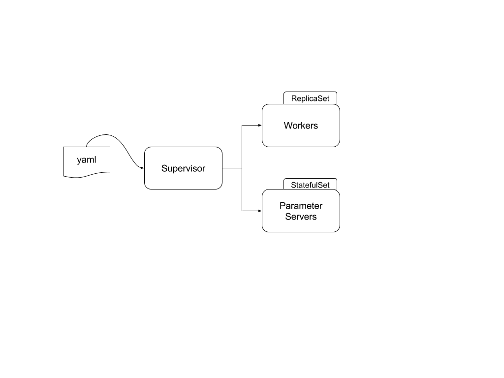

# nserv

Nserv leverages the kubernetes [apiserver-builder](https://github.com/kubernetes-incubator/apiserver-builder) and is a type of User Api Server `[UAS]`. This kubernetes implementation includes the client, types and controller.

The **nserv** controller is called a _Supervisor_ and accepts yaml's of the form 
```
apiVersion: dls.aipg.intel.com/v1
kind: Supervisor
metadata:
  name: tfcluster
  labels:
    name: tfcluster
spec:
  workers:
  - worker0.example.com:2222
  - worker1.example.com:2222
  - worker2.example.com:2222
  ps:
  - ps0.example.com:2222
  - ps1.example.com:2222

  workerSpec:
    replicaSetName: workers
    replicas: 1
  psSpec:
    statefulSetName: ps
    replicas: 1
```

This yaml corresponds to the following golang types:
```
// Supervisor
// +k8s:openapi-gen=true
// +resource:path=supervisors,strategy=SupervisorStrategy
type Supervisor struct {
        metav1.TypeMeta   `json:",inline"`
        metav1.ObjectMeta `json:"metadata,omitempty"`

        Spec   SupervisorSpec   `json:"spec,omitempty"`
        Status SupervisorStatus `json:"status,omitempty"`
}

// SupervisorSpec defines the desired state of Supervisor
type SupervisorSpec struct {
        Workers []string `json:",inline"`
        Ps []string `json:",inline"`

        WorkerSpec WorkerSpec `json:"workerSpec,omitempty"`
        PsSpec PsSpec `json:"psSpec,omitempty"`
}

type WorkerSpec struct {
        ReplicaSetName string `json:"replicaSetName"`
        Replicas *int32 `json:"replicas"`
}

type PsSpec struct {
        StatefulSetName string `json:"statefulSetName"`
        Replicas *int32 `json:"replicas"`
}
```

The Supervisor creates both a ReplicaSet and a StatefulSet


## Prerequisites
- docker client for mac [Docker](https://www.docker.com/docker-mac)

## Installation
1. `cd $GOPATH/src/github.com/nervanasystems/nserv`
2. `git clone git@github.com:kkasravi/nerv.git`

## Building
1. `cd $GOPATH/src/github.com/nervanasystems/nserv`
1. `make build`

## Running
1. `cd $GOPATH/src/github.com/nervanasystems/nserv`
2. `make env-up`

## Example
1. `cd $GOPATH/src/github.com/nervanasystems/nserv`
2. `make create-cluster`
3. `make get-cluster`
4. `make delete-cluster`

## Stopping
1. `cd $GOPATH/src/github.com/nervanasystems/nserv`
2. `make env-down`
